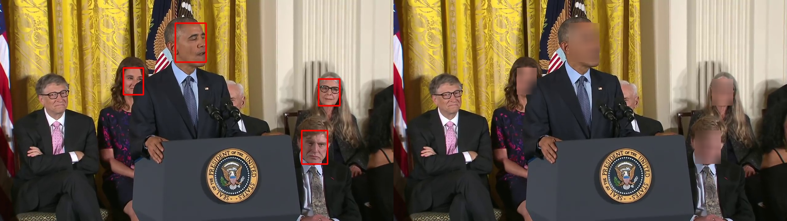
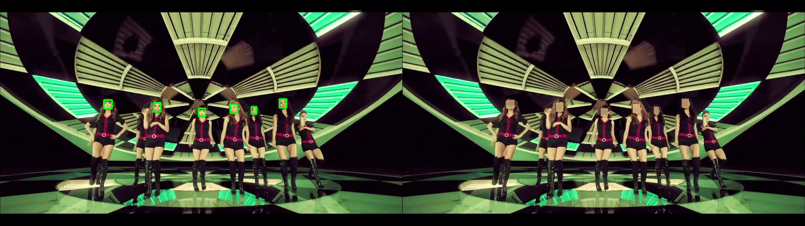

# Face Blurring
**Face detection + Face blurring**
+ Detect all the face from the input video
+ Blur all the detected faces
+ Save the blurred-face video

**Code Author: Shih-Yao (Mike) Lin**


## Platform
+ Ubuntu 16.04
+ GTX-1080

## Dependencies
+ OpenCV > 3.2.0.8
+ Tensorflow > 1.4.1
+ MTCNN 

## Quick Start
```
python face_blurring.py --source_video ./vido.mp4 --output_video ./video_o.mp4 
```

## Visualization results


